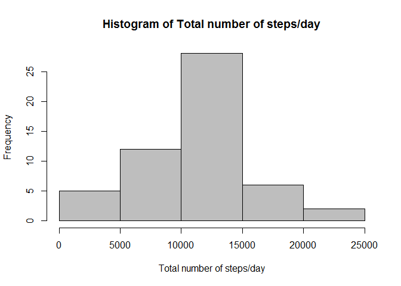
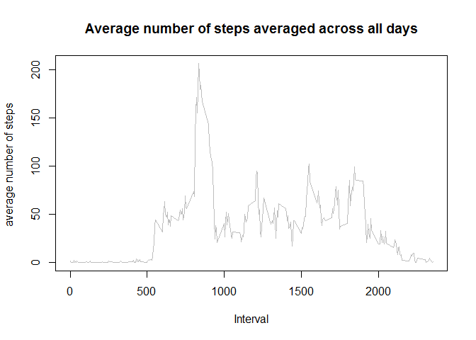
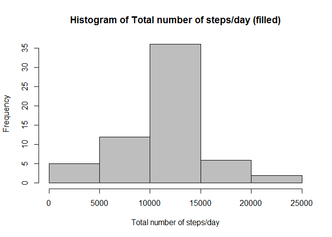

# Reproducible Research: Peer Assessment 1


## Loading and preprocessing the data 


- Here we will load the data from the CSV file using the **read.csv()** function

- Unzip the file and read the CSV file in one line

```r
activity  <- read.csv(unz("activity.zip", "activity.csv") ,sep=",",na.strings='NA',header=TRUE)
```


## What is mean total number of steps taken per day?

- Remove the NA values  


```r
activity_nona <- na.omit(activity)
```


- Aggregate the steps per day using **aggregate**  

```r
activity_day_steps <- aggregate(steps ~ date, activity_nona, sum,na.rm = T)
```

- Create the hisogram of Total number of steps/day


```r
hist(activity_day_steps$steps, col = "gray", 
     xlab = "Total number of steps/day", main = "Histogram of Total number of steps/day")
```

 


- Calculate mean and median of total number of steps per day

```r
mean(activity_day_steps$steps, na.rm=TRUE)
```

```
## [1] 10766.19
```


```r
median(activity_day_steps$steps)
```

```
## [1] 10765
```

- The mean of total number of steps per day is **10766.19** .
- The median of total number of steps per day is  **10765**.


## What is the average daily activity pattern?

- Aggregate the steps per interval using **aggregate**  

```r
activity_interval_steps <- aggregate(steps ~ interval, activity, mean)
```

- Plot the time series plot using **type=1** 

```r
plot(activity_interval_steps$interval, activity_interval_steps$steps, type='l', col = "gray", 
     main="Average number of steps averaged across all days", xlab="Interval", 
     ylab="average number of steps ")
```

 
- get the interval which has the maximum average of steps across all days

```r
max_interval <- activity_interval_steps[which.max(activity_interval_steps$steps),]
max_interval
```

```
##     interval    steps
## 104      835 206.1698
```

- The interval **853** has the maximum average of steps across all days  **206.1698**


## Imputing missing values

- Get the records with NA values

```r
na_count <- nrow(activity[!complete.cases(activity),])
na_count
```

```
## [1] 2304
```

- Number of records with NA values is **2304**

- The strategy will be applied is to fill in any NA value with the mean count of steps vlaue of the same interval calculated before
- Create a new dataset that will have filled NA, loop through records and fill in the NA with mean value

```r
activity_filled <- activity  
for (i in 1:nrow(activity_filled)) {
  if (is.na(activity_filled[i, ]$steps)) {
    interval_val <- activity_filled [i,]$interval
    interval_mean_id <-  which(activity_interval_steps$interval == interval_val)
    activity_filled[i, ]$steps <-activity_interval_steps[interval_mean_id, ]$steps
  }
}
```


- Aggregate the (filled) steps per day using **aggregate**  

```r
activity_day_steps_filled <- aggregate(steps ~ date, activity_filled, sum)
```


- Create the hisogram of Total number of steps/day for the filled NA dataset


```r
hist(activity_day_steps_filled$steps, col = "gray", 
     xlab = "Total number of steps/day", main = "Histogram of Total number of steps/day (filled)")
```

 


- Calculate mean and median of total number of (filled) steps per day

```r
mean(activity_day_steps_filled$steps)
```

```
## [1] 10766.19
```


```r
median(activity_day_steps_filled$steps)
```

```
## [1] 10766.19
```


- The mean total number of (filled) steps taken per day is **10766.19**
The median total number of steps taken per day is **10766.19**

- The mean value is the same as the value before filling missing data because we replaced the NA with the mean value for that particular 5-min interval. However, the median value shows a little difference 

## Are there differences in activity patterns between weekdays and weekends?

- convert date field to the required format

```r
activity_filled$date <- as.Date(activity_filled$date, "%Y-%m-%d")
```

- Create a new factor variable in the dataset with two levels - "weekday" and "weekend"
- initialize the newly created factor with value **weekday**

```r
activity_filled$day <- weekdays(activity_filled$date)
activity_filled$daytype <- c("weekday")
```


- populate the new factor value based on the weekday


```r
for (i in 1:nrow(activity_filled)){
  if (activity_filled$day[i] == "Saturday" || activity_filled$day[i] == "Sunday"){
    activity_filled$daytype[i] <- "weekend"
  }
}
```

- convert day_time from character to factor

```r
activity_filled$daytype <- as.factor(activity_filled$daytype)
```

- aggregate the dataset based on steps,interval and daytype

```r
activity_interval_steps_daytype = aggregate(steps ~ interval + daytype, activity_filled, mean)
```


- Make a panel plot containing a time series plot of the 5-minute interval (x-axis) and the average number of steps taken, averaged across all weekday days or weekend days (y-axis)

```r
library(lattice)
xyplot(steps ~ interval | factor(daytype), data = activity_interval_steps_daytype, aspect = 1/2, 
       type = "l")
```

 
